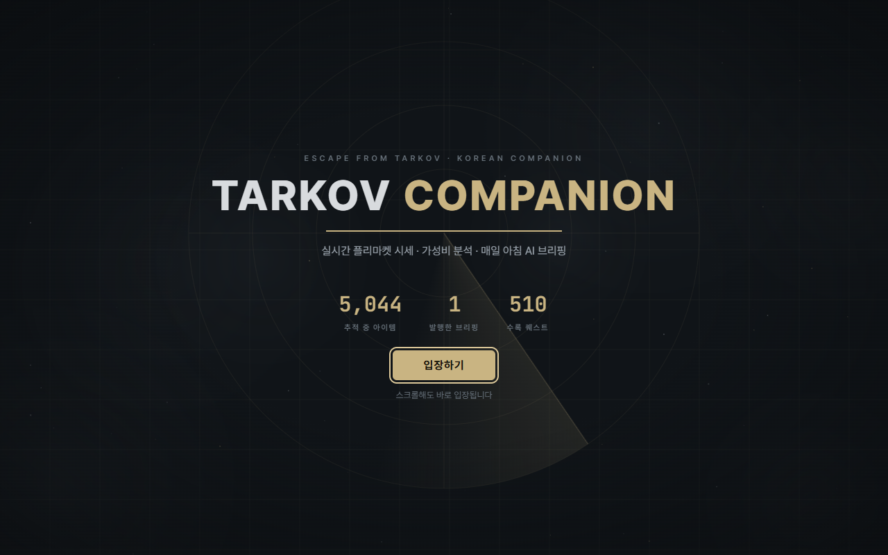
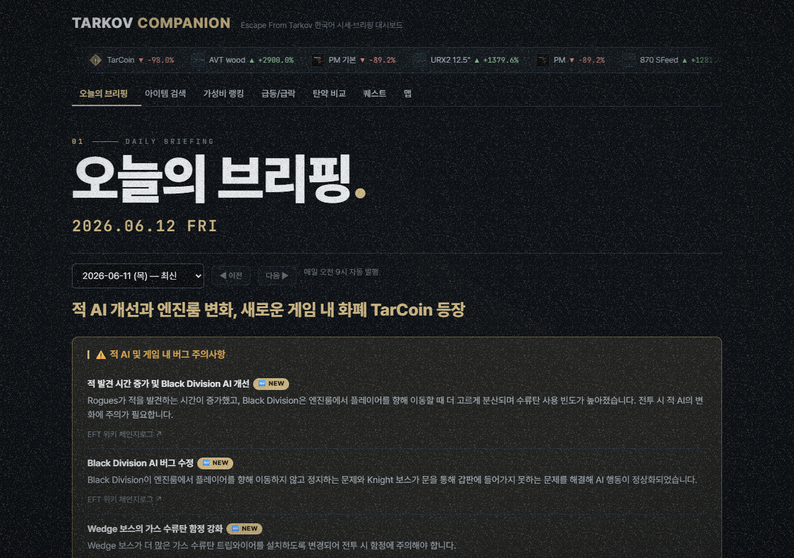
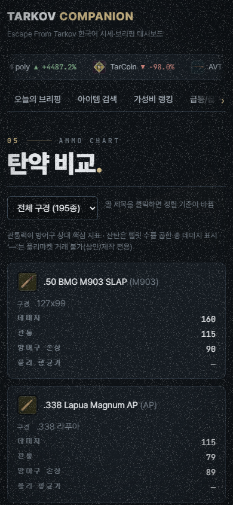

# Tarkov Companion 🎯

[](https://github.com/MoriochoRadio/tarkov-companion/actions/workflows/daily-briefing.yml)
[](LICENSE)

Escape From Tarkov 플레이어를 위한 한국어 컴패니언 웹.
실시간 플리마켓 시세·가성비 분석에, **매일 아침 9시 AI가 자동 작성하는 일일 브리핑**을 더했습니다.

**▶ 사이트: https://moriochoradio.github.io/tarkov-companion/**

> ⚠️ 팬이 만든 **비공식** 도구입니다. Battlestate Games와 아무런 관련·제휴가 없으며, 광고·후원·유료 기능 없는 비상업 프로젝트입니다. ([면책 전문](#면책))



| 데스크톱 | 모바일 |
|---|---|
|  |  |

## 기능

기능은 5개 그룹의 탭으로 묶여 있습니다. `Ctrl+K`로 어느 탭에서든 빠르게 검색·이동할 수 있습니다.

### 📋 브리핑
| 탭 | 설명 |
|---|---|
| 오늘의 브리핑 | 패치노트·커뮤니티 동향·주의사항을 매일 오전 9시(KST) AI가 한국어로 요약. 이전 날짜·주간 메타 리포트도 조회 가능 |

### 🗺️ 퀘스트 도구
| 탭 | 설명 |
|---|---|
| 퀘스트 | tarkov.dev 기반 510여 개 퀘스트 브라우저 — 트레이더/맵/레벨 필터, 한/영 검색, 목표·보상·선후행 체인. 1.0 스토리라인 챕터 공략 별도 수록 |
| FIR | 좌우 2분할 운영 화면 — 좌측에서 상인별 퀘스트를 골라 "클리어함"/스테이션 "건축 완료"를 누르면 그 FIR 수요가 우측 분류별(장비·정크박스·음식·의료·기타) 정크박스 그리드에서 실시간으로 빠짐. 보유분은 `− 보유 +` 스테퍼로 직접 증감(수량을 바꿔도 타일 위치 고정). 통합 체크리스트·은신처 의존성 조직도·상인별 상세도 보조 보기로 내장 |
| 플래너 | "한 레이드에 몰아 밀기" — 맵별 퀘스트 다중 선택 → 목표 유형 분류 + 지참물 가방 + **맵 위 마커 오버레이** |
| 해금 | 아이템 → 그것을 해금하는 퀘스트 역인덱스 + 선행 퀘스트 체인 전체 (진행 순서대로) |

### 💰 시세 도구
| 탭 | 설명 |
|---|---|
| 아이템 검색 | 한/영 이름 검색, 플리마켓 평균가·변동률·실수익(수수료 제외)·시세 스파크라인·가격 알림(🔔) |
| 가성비 랭킹 | 슬롯당 가치 상위 50 — 레이드에서 뭘 챙길지. 수수료 제외 실수익 기준 토글 |
| 급등/급락 | 48시간 변동률 톱 20씩 (저가 노이즈 필터링) |
| 돈벌이 | 크래프트·바터 실시간 수익 랭킹 + 열쇠 가성비 (내 은신처 보유 레벨 연동) |
| 탄약 비교 | 195종 — 구경 필터, 데미지/관통/방어구 손상/가격 정렬 + 방어구 클래스별 관통 효율 색상 차트 |

### 🔫 모딩
| 탭 | 설명 |
|---|---|
| 모딩 | 레벨별 추천 무기 빌드 카드 (실시간 시세 총비용 + 에르고/반동 보정 + 추천 탄약). 부품 직접 탐색 모드 |

### 🗺️ 맵
| 탭 | 설명 |
|---|---|
| 맵 | 맵별 레이드/인원/보스/요구 키 정보 + 진영별 탈출구 목록 |

> 그 밖에: PWA(홈 화면 추가·오프라인 캐시), localStorage 데이터 백업 내보내기/가져오기, 모바일 전면 대응.

## 동작 원리 — 서버 없이, 운영비 0원

```
[방문자 브라우저] ──직접 호출──> api.tarkov.dev/graphql (무료 공개 API)
       │
       └─ GitHub Pages (정적 호스팅)
              ▲
              │ 커밋 → 자동 배포 (매일 09:00 KST)
[GitHub Actions] ── 뉴스·커뮤니티 수집 → GitHub Models로 한국어 요약 → 브리핑 JSON
```

- **시세**: 방문자의 브라우저가 [tarkov.dev](https://tarkov.dev/api/) 공개 API를 직접 호출 — 서버·키·비용 없음
- **브리핑**: GitHub Actions가 매일 EFT 위키 체인지로그·Reddit(인기글+버그 제보)·YouTube 신규 영상·Steam 뉴스를 수집하고, [GitHub Models](https://docs.github.com/en/github-models)(무료)로 2단계 요약(소스별 → 통합)해 정적 JSON으로 커밋 — 사람 개입 없이 완전 자동. 매주 월요일엔 주간 메타 리포트도 발행
- AI 요약이 실패하는 날에도 제목+링크 목록으로 폴백되어 브리핑이 비는 날이 없음

상세 설계는 [docs/DESIGN.md](docs/DESIGN.md), 브리핑 데이터 형식은 [docs/briefing-schema.md](docs/briefing-schema.md) 참고.

## 로컬 개발

```bash
npm install   # 최초 1회
npm run dev   # 개발 서버 (http://localhost:5173)
npm run build # 프로덕션 빌드
```

main에 push하면 GitHub Actions가 자동으로 빌드·배포합니다.
브리핑 파이프라인은 Actions 탭에서 `daily-briefing` 워크플로우를 수동 실행(workflow_dispatch)해 테스트할 수 있습니다.

## 데이터 출처 · 크레딧

- 시세/아이템 데이터·아이콘: [tarkov.dev](https://tarkov.dev/) — 무료 오픈소스 커뮤니티 API. 본 사이트는 데이터를 저장하지 않고 방문자 브라우저가 직접 조회합니다
- 패치노트: [Escape from Tarkov Wiki(Fandom) 체인지로그](https://escapefromtarkov.fandom.com/wiki/Changelog) — 위키 텍스트 콘텐츠는 [CC BY-SA](https://www.fandom.com/licensing) 라이선스를 따르며, 브리핑에서는 출처 링크와 함께 요약·인용합니다
- 커뮤니티 동향: [r/EscapefromTarkov](https://www.reddit.com/r/EscapefromTarkov/) — 공개 RSS 피드 기반. 각 게시물의 권리는 해당 작성자에게 있으며, 브리핑은 원문 링크와 함께 짧은 요약만 제공합니다
- 신규 영상: YouTube 채널 공개 RSS (노잼망겜, 유우양, Pestily, LVNDMARK) — 제목·링크만 수록하며 각 영상의 권리는 해당 채널에 있습니다
- 공식 소식: Steam 뉴스 공개 RSS
- 브리핑 요약 생성: [GitHub Models](https://docs.github.com/en/github-models)
- 맵 지도 SVG: [The Hideout 커뮤니티 — tarkov-dev-svg-maps](https://github.com/the-hideout/tarkov-dev-svg-maps) ([CC BY-NC-SA 4.0](https://creativecommons.org/licenses/by-nc-sa/4.0/)) · 좌표 변환 메타: [the-hideout/tarkov-dev](https://github.com/the-hideout/tarkov-dev) maps.json (MIT) — 상세는 [`public/maps/LICENSE.md`](public/maps/LICENSE.md). **본 사이트는 광고·후원·유료 기능이 없는 비상업 팬 프로젝트로 NC(비상업) 조건을 준수하며, 이 에셋을 사용하는 동안에는 상업화하지 않습니다.** 퀘스트 마커는 런타임 오버레이로만 그려 지도 파생 파일을 만들지 않습니다

## 면책

- 본 프로젝트는 팬이 만든 **비공식** 도구로, Battlestate Games와 아무런 관련이 없으며 어떠한 제휴·승인·후원 관계도 없습니다. Escape from Tarkov™ 및 관련 상표·게임 데이터·이미지의 모든 권리는 Battlestate Games Limited 등 각 권리자에게 있습니다.
- **일일 브리핑은 AI가 자동 생성한 요약입니다.** 부정확하거나 오래된 정보가 포함될 수 있으며, 정확한 내용은 각 항목의 원문 출처를 확인하세요. 본 사이트의 정보(시세·공략 포함)를 활용한 게임 내 판단과 그 결과는 이용자 본인의 책임입니다.
- 시세 데이터는 tarkov.dev가 제공하는 시점 기준이며 실제 게임 내 가격과 차이가 있을 수 있습니다.
- 맵 지도와 퀘스트 마커 좌표는 커뮤니티 제작 데이터 기준이라 게임 패치에 따라 실제 위치와 다를 수 있습니다. 일부 목표는 API에 좌표가 없어 마커로 표시되지 않습니다(화면에 명시).
- 권리자(Battlestate Games 또는 콘텐츠 원작자)의 요청이 있을 경우 해당 콘텐츠를 즉시 수정·삭제하겠습니다. 문의: GitHub Issues

## 라이선스

이 저장소의 **소스 코드**는 [MIT 라이선스](LICENSE)로 자유롭게 사용·수정·배포할 수 있습니다.
단, MIT 라이선스는 외부에서 가져오는 게임 데이터·아이콘·위키/커뮤니티 콘텐츠에는 적용되지 않으며, 이들의 권리는 위 "데이터 출처" 항목의 각 권리자에게 있습니다.
